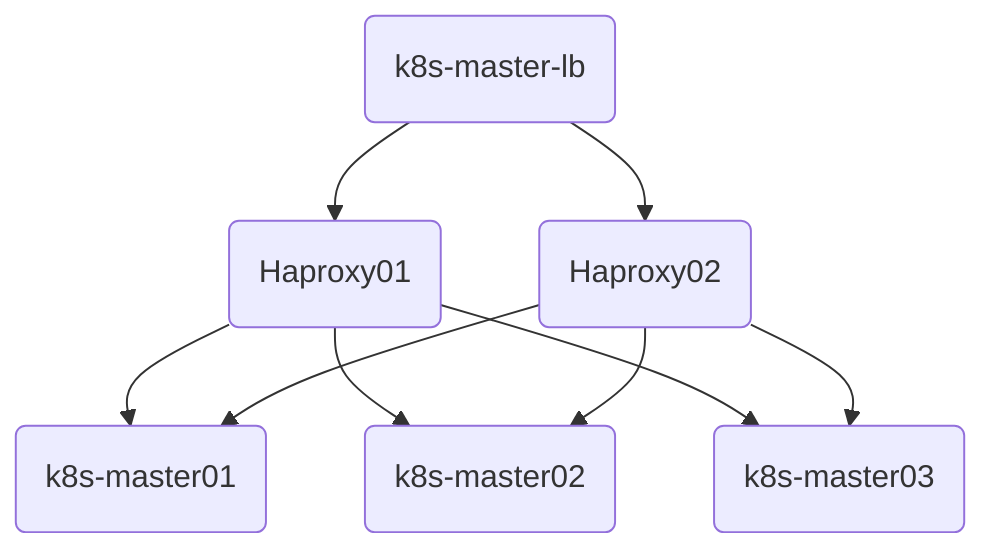

## kube-apiserver高可用实现（阿里云HaVip+Keepalived+Haproxy）

阿里云的slb有回环的问题，因此采用阿里云**HaVip**+keepalived+Haproxy实现kube-apiserver的高可用。

高可用架构如下图所示，由于HaVip只能绑定两个后端，且为节省机器，将Haproxy复用到master01、02节点。

> 参考阿里云官方文档：[HaVip结合keepalived实现主备双机高可用](https://help.aliyun.com/document_detail/184485.html?spm=5176.11182181.0.dexternal.61534882ClDyIr)



- Master01、02节点通过yum安装HAProxy和KeepAlived

```shell
yum install keepalived haproxy -y
```

- 配置HAProxy（配置相同）

```shell
vim /etc/haproxy/haproxy.cfg 
```

```
global
  maxconn  2000
  ulimit-n  16384
  log  127.0.0.1 local0 err
  stats timeout 30s

defaults
  log global
  mode  http
  option  httplog
  timeout connect 5000
  timeout client  50000
  timeout server  50000
  timeout http-request 15s
  timeout http-keep-alive 15s

frontend monitor-in
  bind *:33305
  mode http
  option httplog
  monitor-uri /monitor

frontend k8s-master
  bind 0.0.0.0:16443
  bind 127.0.0.1:16443
  mode tcp
  option tcplog
  tcp-request inspect-delay 5s
  default_backend k8s-master

backend k8s-master
  mode tcp
  option tcplog
  option tcp-check
  balance roundrobin
  default-server inter 10s downinter 5s rise 2 fall 2 slowstart 60s maxconn 250 maxqueue 256 weight 100
  server k8s-master01	10.0.0.11:6443  check
  server k8s-master02	10.0.0.12:6443  check
  server k8s-master03	10.0.0.13:6443  check
```

- 配置keepalived（需区分每个节点的IP和网卡）

```shell
vim /etc/keepalived/keepalived.conf
```

```
global_defs {
    router_id LVS_DEVEL
    script_user root
    enable_script_security
}

vrrp_script chk_apiserver {
    script "/etc/keepalived/check_apiserver.sh"
    interval 5
    weight -5
    fall 2  
    rise 1
    }

vrrp_instance VI_1 {            
    state MASTER             # 主=MASTER，从=BACKUP
    interface eth0
    unicast_src_ip 10.0.0.11
    virtual_router_id 52     # 唯一ID
    priority 100             # 主=100，从<100
    advert_int 1
    authentication {
        auth_type PASS
        auth_pass K8SHA_KA_AUTH
    }
    unicast_peer {
        10.0.0.12            # 对端节点
    }
    virtual_ipaddress {
        10.0.0.10            # 高可用虚拟IP
    }
    track_script {
        chk_apiserver
    }
}
```

- 配置KeepAlived健康检查

```shell
vim /etc/keepalived/check_apiserver.sh 
```

```shell
#!/bin/bash
err=0
for k in $(seq 1 3)
do
    check_code=$(pgrep haproxy)
    if [[ $check_code == "" ]]; then
        err=$(expr $err + 1)
        sleep 1
        continue
    else
        err=0
        break
    fi
done

if [[ $err != "0" ]]; then
    echo "systemctl stop keepalived"
    /usr/bin/systemctl stop keepalived
    exit 1
else
    exit 0
fi
```

```shell
# 执行权限
chmod +x /etc/keepalived/check_apiserver.sh
```

- 启动haproxy和keepalived

```shell
systemctl daemon-reload &&
systemctl enable --now haproxy &&
systemctl enable --now keepalived

# systemctl restart keepalived && systemctl status keepalived
```

- 测试keepalived是否正常

```shell
ping 10.0.0.10 -c 4
telnet 10.0.0.10 16443
```
