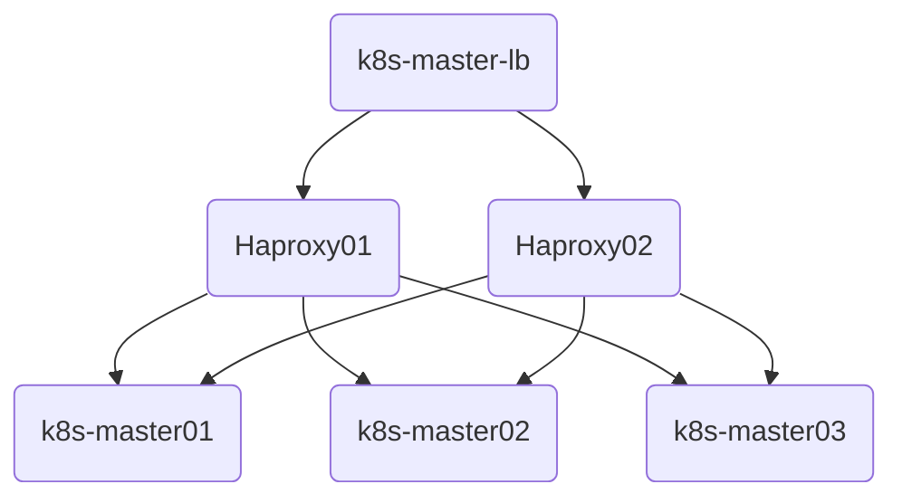

# Kubeadm方式安装高可用k8s集群

> 参考自杜老师（github.com/dotbalo）的[基于世界500强的k8s实战课程](https://ke.qq.com/course/2738602)。

- [1. 基本环境配置](#1-基本环境配置)
- [2. 服务器优化及内核升级](#2-服务器优化及内核升级)
- [3. 安装Runtime](#3-安装runtime)
- [4. 安装k8s组件](#4-安装k8s组件)
- [5. kube-apiserver高可用实现](#5-kube-apiserver高可用实现)
- [6. 集群初始化](#6-集群初始化)
- [7. 配置kubectl](#7-配置kubectl)
- [8. 集群外主机通过kubectl控制集群](#8-集群外主机通过kubectl控制集群)
- [9. 重新生成Token](#9-重新生成token)
- [10. 安装Calico](#10-安装calico)
- [11. Metrics部署](#11-metrics部署)
- [12. Dashboard部署](#12-dashboard部署)
- [13. Kube-proxy改为ipvs模式](#13-kube-proxy改为ipvs模式)
- [14. 证书更新（`待补充`）](#14-证书更新待补充)
- [15. 集群升级（`待补充`）](#15-集群升级待补充)
- [16. 集群备份与恢复（`待补充`）](#16-集群备份与恢复待补充)
## 1. 基本环境配置

- 集群规划：k8s节点使用阿里云抢占式示例，k8s-master-lb通过阿里云HaVip实现。

| 主机          | IP地址     | 说明                  | 需手动安装组件                                |
| ------------- | ---------- | --------------------- | --------------------------------------------- |
| k8s-master-lb | 10.0.0.10  | 高可用虚拟IP（HaVip） |                                               |
| k8s-master01  | 10.0.0.11  | Master01节点          | kubeadm，kubelet，keepalived+haproxy，kubectl |
| k8s-master02  | 10.0.0.12  | Master02节点          | kubeadm，kubelet，keepalived+haproxy          |
| k8s-master03  | 10.0.0.13  | Master03节点          | kubeadm，kubelet                              |
| k8s-node01    | 10.0.0.101 | Node01节点            | kubeadm，kubelet                              |

- 网段及版本信息

K8S与Docker等的版本[依赖关系](https://github.com/kubernetes/kubernetes/blob/master/build/dependencies.yaml)

| 配置信息    | 说明              |
| ----------- | ----------------- |
| 系统版本    | CentOS7.9         |
| 内核        | kernel-ml-4.19.12 |
| K8S版本     | 1.23.*            |
| Docker版本  | 20.10.*           |
| 主机网段    | 10.0.0.0/24       |
| Pod网段     | 172.16.0.0/12     |
| Service网段 | 192.168.0.0/16    |

- kubeadm安装方式各组件配置

| 组件                    | 运行方式 | 配置所在位置                                         | 生效方式                           |
| ----------------------- | -------- | ---------------------------------------------------- | ---------------------------------- |
| kubelet                 | 主机     | /etc/sysconfig/kubelet; /var/lib/kubelet/config.yaml | 重启kubelet进程                    |
| etcd                    | 容器     | /etc/kubernetes/manifests                            | 等待自动刷新重启pod，或重启kubelet |
| kube-apiserver          | 容器     | /etc/kubernetes/manifests                            | 同上                               |
| kube-scheduler          | 容器     | /etc/kubernetes/manifests                            | 同上                               |
| kube-controller-manager | 容器     | /etc/kubernetes/manifests                            | 同上                               |
| kube-proxy              | 容器     | configmap                                            | 修改configmap，再patch重启         |

## 2. 服务器优化及内核升级

> 参考 [02-K8S/01-K8S安装篇/01-公共配置篇/01-服务器优化及内核升级.md](/02-K8S/01-K8S安装篇/01-公共配置篇/01-服务器优化及内核升级.md)

## 3. 安装Runtime

> 参考 [02-K8S/01-K8S安装篇/01-公共配置篇/02-Runtime安装.md](/02-K8S/01-K8S安装篇/01-公共配置篇/02-Runtime安装.md)，本文选用containerd

## 4. 安装k8s组件

需要在每台机器上安装以下的软件包:

- kubeadm：用来初始化集群的指令。
- kubelet：在集群中的每个节点上用来启动 Pod 和容器等。
- kubectl：用来与集群通信的命令行工具。

kubeadm **不能** 安装或者管理 `kubelet` 和 `kubectl`，所以需要确保它们与通过 kubeadm 安装的控制平面的版本相匹配。 注意kubelet 的版本不可以超过 API 服务器的版本。 

- 查看最新的Kubernetes版本

```shell
yum list kubeadm.x86_64 --showduplicates | sort -r
```

- 所有节点安装1.23最新版本kubeadm、kubelet和kubectl

```shell
yum install kubeadm-1.23* kubelet-1.23* kubectl-1.23* -y
```

- 如果选择的是Containerd作为的Runtime，需要更改Kubelet的配置使用Containerd作为Runtime

```sh
cat >/etc/sysconfig/kubelet<<EOF
KUBELET_KUBEADM_ARGS="--container-runtime=remote --runtime-request-timeout=15m --container-runtime-endpoint=unix:///run/containerd/containerd.sock"
EOF
```

- 所有节点设置Kubelet开机自启动（由于还未初始化，没有kubelet的配置文件，此时kubelet无法启动，无需管理）

```shell
systemctl daemon-reload && systemctl enable --now kubelet
```

## 5. kube-apiserver高可用实现

采用阿里云**HaVip**+keepalived+Haproxy实现kube-apiserver的高可用。

> 参考 [02-K8S/01-K8S安装篇/01-公共配置篇/03-HA高可用架构.md](/02-K8S/01-K8S安装篇/01-公共配置篇/03-HA高可用架构.md)




## 6. 集群初始化

- Master01节点创建kubeadm-config.yaml配置文件

- 证书建议添加一个域名，通过配置hosts绑定任意IP

```shell
vim kubeadm-config.yaml
```

```yaml
apiVersion: kubeadm.k8s.io/v1beta2
bootstrapTokens:
- groups:
  - system:bootstrappers:kubeadm:default-node-token
  token: 7t2weq.bjbawausm0jaxury
  ttl: 24h0m0s
  usages:
  - signing
  - authentication
kind: InitConfiguration
localAPIEndpoint:
  advertiseAddress: 10.0.0.11
  bindPort: 6443
nodeRegistration:
  # criSocket: /var/run/dockershim.sock  # 如果是Docker作为Runtime配置此项
  criSocket: /run/containerd/containerd.sock # 如果是Containerd作为Runtime配置此项
  name: k8s-master01
  taints:
  - effect: NoSchedule
    key: node-role.kubernetes.io/master
---
apiServer:
  certSANs:
  - 10.0.0.10
  - apiserver.l2c.cn
  timeoutForControlPlane: 4m0s
apiVersion: kubeadm.k8s.io/v1beta2
certificatesDir: /etc/kubernetes/pki
clusterName: kubernetes
controlPlaneEndpoint: 10.0.0.10:16443
controllerManager: {}
dns:
  type: CoreDNS
etcd:
  local:
    dataDir: /var/lib/etcd
imageRepository: registry.cn-hangzhou.aliyuncs.com/google_containers
kind: ClusterConfiguration
kubernetesVersion: v1.23.4  # 更改此处的版本号和kubeadm version一致
networking:
  dnsDomain: cluster.local
  podSubnet: 172.16.0.0/12
  serviceSubnet: 192.168.0.0/16
scheduler: {}
```

- 更新kubeadm文件

```shell
kubeadm config migrate --old-config kubeadm-config.yaml --new-config new.yaml
```

- 将new.yaml文件复制到其他master节点

```shell
for i in k8s-master02 k8s-master03; do scp new.yaml $i:/root/; done
```

- 所有Master节点提前下载镜像

```shell
kubeadm config images pull --config /root/new.yaml
```

- **Master01**节点初始化，将在/etc/kubernetes目录下生成对应的证书和配置文件

```shell
kubeadm init --config /root/new.yaml  --upload-certs
```

- 如果初始化失败，重置后再次初始化，命令如下（没有失败不要执行）

```shell
kubeadm reset -f ; ipvsadm --clear  ; rm -rf ~/.kube
```

- 记录Token（24小时有效期），将其它节点加入集群

```shell
# Master节点加入集群，相比Node节点多了--control-plane --certificate-key
kubeadm join 10.0.0.10:16443 --token 7t2weq.bjbawausm0jaxury \
--discovery-token-ca-cert-hash sha256:37f648ad9392585b1b0d244c8e6e013b36a96f95804e77942dfaf8d905c9f105 \
--control-plane --certificate-key 13cc4d626266f8764f2f66b77de7b5227c2025b10c781354694fd2e273dd64bf

# Node节点加入集群
kubeadm join 10.0.0.10:16443 --token 7t2weq.bjbawausm0jaxury \
--discovery-token-ca-cert-hash sha256:37f648ad9392585b1b0d244c8e6e013b36a96f95804e77942dfaf8d905c9f105 
```

## 7. 配置kubectl

- Master01节点配置kubectl，控制集群

```shell
mkdir -p $HOME/.kube
sudo cp -i /etc/kubernetes/admin.conf $HOME/.kube/config
sudo chown $(id -u):$(id -g) $HOME/.kube/config
```

- kubectl命令补全工具

```shell
yum install -y bash-completion
source /usr/share/bash-completion/bash_completion &&
source <(kubectl completion bash) &&
echo "source <(kubectl completion bash)" >> ~/.bashrc
```

## 8. 集群外主机通过kubectl控制集群

- 申请弹性公网IP，绑定至HaVip


- 集群外主机安装同版本kubectl，并配置`$HOME/.kube/config`

```shell
yum install kubectl-1.23* -y
```

```shell
# 制master的配置创建$HOME/.kube/config，并修改server地址为域名：
server: https://apiserver.l2c.cn:16443
```

- 阿里云控制台配置安全组规则，开放16443端口权限，可仅对指定IP、IP断开放


- 在集群外主机上配置hosts

```shell
vim /etc/hosts   # 增加一条,此ip即为HaVip绑定的弹性公网IP
-----------------------------
39.99.132.75 apiserver.l2c.cn
```

- 测试


## 9. 重新生成Token

- 生成新的token

```shell
kubeadm token create --print-join-command
```

- 生成--certificate-key

```shell
kubeadm init phase upload-certs  --upload-certs
```

- 加入（若已踢出的节点，需删除/etc/kubeneters目录）

```shell
kubeadm join 10.0.0.10:16443 --token akmuqu.dxebbi6umhanqczx \
--discovery-token-ca-cert-hash sha256:37f648ad9392585b1b0d244c8e6e013b36a96f95804e77942dfaf8d905c9f105

kubeadm join 10.0.0.10:16443 --token akmuqu.dxebbi6umhanqczx \
--discovery-token-ca-cert-hash sha256:37f648ad9392585b1b0d244c8e6e013b36a96f95804e77942dfaf8d905c9f105 \
--control-plane --certificate-key 1e39d8ab7bf18a6425a4c2fae5cfaa8f7a56df442231143cf200d2825ea73a4
```

## 10. 安装Calico

> 官方地址：[Calico官方安装方法](https://projectcalico.docs.tigera.io/getting-started/kubernetes/self-managed-onprem/onpremises)

- 下载calico部署文件

```shell
curl https://projectcalico.docs.tigera.io/manifests/calico.yaml -o calico.yaml
```

- 若POD网段不是192.168.0.0/16，需打开注释修改：CALICO_IPV4POOL_CIDR

```yaml
- name: CALICO_IPV4POOL_CIDR
  value: "172.16.0.0/12"
```

## 11. Metrics部署

在新版的Kubernetes中系统资源的采集均使用Metrics-server，可以通过Metrics采集节点和Pod的内存、磁盘、CPU和网络的使用率

> 官方地址：[Kubernetes Metrics Server](https://github.com/kubernetes-sigs/metrics-server)

- 将Master01节点的front-proxy-ca.crt复制到所有Node节点

```shell
for i in k8s-node01; do scp /etc/kubernetes/pki/front-proxy-ca.crt $i:/etc/kubernetes/pki/front-proxy-ca.crt; done
```

```shell
wget https://github.com/kubernetes-sigs/metrics-server/releases/latest/download/components.yaml
```

- 修改参数及镜像

```shell
vim components.yaml
```

```yaml
      - args:
        - --cert-dir=/tmp
        - --secure-port=4443
        - --kubelet-preferred-address-types=InternalIP,ExternalIP,Hostname
        - --kubelet-use-node-status-port
        - --metric-resolution=15s
        - --kubelet-insecure-tls
        - --requestheader-client-ca-file=/etc/kubernetes/pki/front-proxy-ca.crt 
        - --requestheader-username-headers=X-Remote-User
        - --requestheader-group-headers=X-Remote-Group
        - --requestheader-extra-headers-prefix=X-Remote-Extra-
        image: registry.cn-hangzhou.aliyuncs.com/google_containers/metrics-server:v0.6.1
```

- 挂载证书

```yaml
        volumeMounts:
        - mountPath: /tmp
          name: tmp-dir
        - name: ca-ssl
          mountPath: /etc/kubernetes/pki
      nodeSelector:
        kubernetes.io/os: linux
      priorityClassName: system-cluster-critical
      serviceAccountName: metrics-server
      volumes:
      - emptyDir: {}
        name: tmp-dir
      - name: ca-ssl
        hostPath:
          path: /etc/kubernetes/pki
```

## 12. Dashboard部署

Dashboard用于展示集群中的各类资源，同时也可以通过Dashboard实时查看Pod的日志和在容器中执行一些命令等。

> 官方地址： [K8S官方Dashboard最新部署模板](https://github.com/kubernetes/dashboard/blob/master/aio/deploy/recommended.yaml)

- 下载最新部署模板

```
wget https://raw.githubusercontent.com/kubernetes/dashboard/master/aio/deploy/recommended.yaml
```

- 修改service

```shell
vim recommended.yaml
```

```yaml
kind: Service
apiVersion: v1
metadata:
  labels:
    k8s-app: kubernetes-dashboard
  name: kubernetes-dashboard
  namespace: kubernetes-dashboard
spec:
  type: NodePort
  ports:
    - port: 443
      nodePort: 31443
      targetPort: 8443
  selector:
    k8s-app: kubernetes-dashboard
```

```shell
kubectl apply -f recommended.yaml
```

- 创建用户

```shell
vim admin.yaml
```

```yaml
apiVersion: v1
kind: ServiceAccount
metadata:
  name: admin-user
  namespace: kube-system
---
apiVersion: rbac.authorization.k8s.io/v1
kind: ClusterRoleBinding 
metadata: 
  name: admin-user
  annotations:
    rbac.authorization.kubernetes.io/autoupdate: "true"
roleRef:
  apiGroup: rbac.authorization.k8s.io
  kind: ClusterRole
  name: cluster-admin
subjects:
- kind: ServiceAccount
  name: admin-user
  namespace: kube-system
```

- 查看Token

```shell
kubectl -n kube-system describe secret $(kubectl -n kube-system get secret | grep admin-user | awk '{print $1}')
```

- 配置安全组策略，开放该NodePort即可访问

## 13. Kube-proxy改为ipvs模式

- master01节点执行

```shell
kubectl edit cm kube-proxy -n kube-system
-----------------------------------------------
mode: ipvs
```

- 更新Kube-Proxy的Pod

```shell
kubectl patch daemonset kube-proxy -p "{\"spec\":{\"template\":{\"metadata\":{\"annotations\":{\"date\":\"`date +'%s'`\"}}}}}" -n kube-system
```

- 验证Kube-Proxy模式

```shell
curl 127.0.0.1:10249/proxyMode
---------------------------------
ipvs
```

## 14. 证书更新（`待补充`）

## 15. 集群升级（`待补充`）

## 16. 集群备份与恢复（`待补充`）

