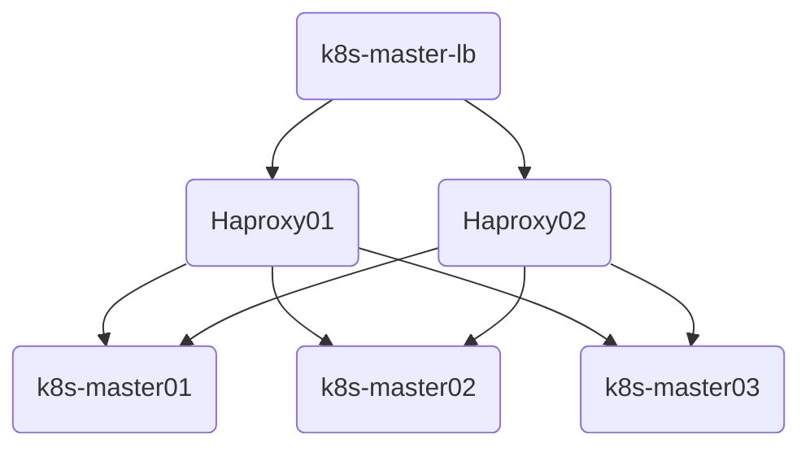

# 二进制安装高可用K8S集群

> 参考自杜老师（github.com/dotbalo）的[基于世界500强的k8s实战课程](https://ke.qq.com/course/2738602)。

[toc]


## 基本环境配置

### 架构介绍

高可用架构同kubeadm方式，采用阿里云**HaVip**+keepalived+Haproxy实现kube-apiserver的高可用。




### 集群规划

k8s节点使用阿里云抢占式示例，k8s-master-lb通过阿里云HaVip实现。

| 主机          | IP地址     | 说明                  | 需手动安装组件                                               |
| ------------- | ---------- | --------------------- | ------------------------------------------------------------ |
| k8s-master-lb | 10.0.0.10  | 高可用虚拟IP（HaVip） |                                                              |
| k8s-master01  | 10.0.0.11  | Master01节点          | etcd, kube-apiserver, controller manager, scheduler, <br />kube-proxy, kubelet, <br />**keepalived+haproxy**, **kubectl** |
| k8s-master02  | 10.0.0.12  | Master02节点          | etcd, kube-apiserver, controller manager, scheduler, <br />kube-proxy, kubelet, <br />**keepalived+haproxy**, |
| k8s-master03  | 10.0.0.13  | Master03节点          | etcd, kube-apiserver, controller manager, scheduler, <br />kube-proxy, kubelet |
| k8s-node01    | 10.0.0.101 | Node01节点            | kube-proxy, kubelet                                          |

### 网段及版本信息

K8S与Docker等的版本[依赖关系](https://github.com/kubernetes/kubernetes/blob/master/build/dependencies.yaml)

| 配置信息    | 说明                         |
| ----------- | ---------------------------- |
| 系统版本    | CentOS7.9                    |
| 内核        | kernel-ml-4.19.12            |
| K8S版本     | 1.23.*                       |
| Docker版本  | 20.10.*                      |
| etcd版本    | 3.5.*                        |
| 主机网段    | 10.0.0.0/24                  |
| Pod网段     | 172.16.0.0/12  10.244.0.0/12 |
| Service网段 | 192.168.0.0/16               |

- kubeadm安装方式各组件配置

| 组件                    | 运行方式 | 配置所在位置                                         | 生效方式                           |
| ----------------------- | -------- | ---------------------------------------------------- | ---------------------------------- |
| kubelet                 | 主机     | /etc/sysconfig/kubelet; /var/lib/kubelet/config.yaml | 重启kubelet进程                    |
| etcd                    | 容器     | /etc/kubernetes/manifests                            | 等待自动刷新重启pod，或重启kubelet |
| kube-apiserver          | 容器     | /etc/kubernetes/manifests                            | 同上                               |
| kube-scheduler          | 容器     | /etc/kubernetes/manifests                            | 同上                               |
| kube-controller-manager | 容器     | /etc/kubernetes/manifests                            | 同上                               |
| kube-proxy              | 容器     | configmap                                            | 修改configmap，再patch重启         |

## 服务器优化及内核升级

> 参考 [02-K8S/01-K8S安装篇/01-公共配置篇/01-服务器优化及内核升级.md](/02-K8S/01-K8S安装篇/01-公共配置篇/01-服务器优化及内核升级.md)

## 安装Runtime

> 参考 [02-K8S/01-K8S安装篇/01-公共配置篇/02-Runtime安装.md](/02-K8S/01-K8S安装篇/01-公共配置篇/02-Runtime安装.md)，本文选用containerd

## kube-apiserver高可用实现

采用阿里云**HaVip**+keepalived+Haproxy实现kube-apiserver的高可用。

> 参考 [02-K8S/01-K8S安装篇/01-公共配置篇/03-HA高可用架构.md](/02-K8S/01-K8S安装篇/01-公共配置篇/03-HA高可用架构.md)


## K8S&ETCD安装包下载

### kubernetes

- 下载kubernetes安装包，选择当前最新的**稳定版**（v1.23.4），官方发布地址：

```shell
https://github.com/kubernetes/kubernetes/tree/master/CHANGELOG

# server版包括了所有组件
wget https://dl.k8s.io/v1.23.4/kubernetes-server-linux-amd64.tar.gz 
```


### etcd

etcd是CoreOS团队于2013年6月发起的开源项目，它的目标是构建一个高可用的分布式键值(key-value)数据库。etcd内部采用`raft`协议作为一致性算法，etcd基于Go语言实现。

- 下载etcd安装包，选择v3.5.2，官方发布地址：

```shell
https://github.com/etcd-io/etcd/releases

wget https://github.com/etcd-io/etcd/releases/download/v3.5.2/etcd-v3.5.2-linux-amd64.tar.gz
```

### 解压并分发

- 分别解压

```shell
# 解压kubernetes安装文件
tar -xf kubernetes-server-linux-amd64.tar.gz  --strip-components=3 -C /usr/local/bin kubernetes/server/bin/kube{let,ctl,-apiserver,-controller-manager,-scheduler,-proxy}

# 解压etcd安装文件
tar -zxvf etcd-v3.5.2-linux-amd64.tar.gz --strip-components=1 -C /usr/local/bin etcd-v3.5.2-linux-amd64/etcd{,ctl}
```

- 将组件发送到其他节点

```shell
MasterNodes='k8s-master02 k8s-master03'
WorkNodes='k8s-node01'
for NODE in $MasterNodes; do echo $NODE; scp /usr/local/bin/kube{let,ctl,-apiserver,-controller-manager,-scheduler,-proxy} $NODE:/usr/local/bin/; scp /usr/local/bin/etcd* $NODE:/usr/local/bin/; done
for NODE in $WorkNodes; do scp /usr/local/bin/kube{let,-proxy} $NODE:/usr/local/bin/; done
```

## 制作证书

Kubernetes 系统各组件需要使用 TLS 证书对通信进行加密。

### 下载生成证书工具CFSSL

[CFSSL](https://github.com/cloudflare/cfssl)是CloudFlare开源的一款PKI/TLS工具，CFSSL包含一个命令行工具和一个用于签名，验证并且捆绑TLS证书的HTTP API服务,使用Go语言编写。在使用etcd，kubernetes等组件的过程中会大量接触到证书的生成和使用。

```shell
wget "https://github.com/cloudflare/cfssl/releases/download/v1.6.1/cfssl_1.6.1_linux_amd64" -O /usr/local/bin/cfssl
wget "https://github.com/cloudflare/cfssl/releases/download/v1.6.1/cfssljson_1.6.1_linux_amd64" -O /usr/local/bin/cfssljson

# 自行上传
mv cfssl_1.6.1_linux_amd64  /usr/local/bin/cfssl
mv cfssljson_1.6.1_linux_amd64 /usr/local/bin/cfssljson

chmod +x /usr/local/bin/cfssl /usr/local/bin/cfssljson
```

### ETCD证书

- 创建etcd证书目录

```shell
mkdir -p /etc/etcd/ssl
```

- 创建**etcd-ca-csr.json**，修改年限为100年

```
CN（Common Name)：etcd/kube-apiserver从证书中提取该字段作为请求的用户名 (User Name)；浏览器使用该字段验证网站是否合法，一般写的是域名。
O（Organization）：etcd/kube-apiserver 从证书中提取该字段作为请求用户所属的组 (Group)；

这两个参数在后面的kubernetes启用RBAC模式中很重要，因为需要设置kubelet、admin等角色权限

C（Country）: 国家
ST（State）: 州，省
L（Locality）：地区，城市
O: Organization Name，组织名称，公司名称
OU（Organization Unit Name）: 组织单位名称，公司部门
```


```shell
cat > etcd-ca-csr.json << EOF
{
  "CN": "etcd",
  "key": {
    "algo": "rsa",
    "size": 2048
  },
  "names": [
    {
      "C": "CN",
      "ST": "Beijing",
      "L": "Beijing",
      "O": "etcd",
      "OU": "Etcd Security"
    }
  ],
  "ca": {
    "expiry": "876000h"
  }
}
EOF
```

- 生成etcd的CA认证中心

```shell
# 初始化创建CA认证中心，将会生成 ca-key.pem（私钥）  ca.pem（公钥）
cfssl gencert -initca etcd-ca-csr.json | cfssljson -bare /etc/etcd/ssl/etcd-ca

# etcd-ca.csr      # 根证书申请文件
# etcd-ca-key.pem  # 根证书私钥
# etcd-ca.pem      # 根证书公钥

# 查看证书时间
openssl x509 -in etcd-ca.pem -noout -text |grep ' Not '
```

- 创建ca-config.json

```
知识点：
ca-config.json：可以定义多个 profiles，分别指定不同的过期时间、使用场景等参数；后续在签名证书时使用某个 profile；此实例只有一个kubernetes模板。

signing：表示该证书可用于签名其它证书；生成的 ca.pem 证书中 CA=TRUE；
server auth：表示client可以用该CA对server提供的证书进行验证；
client auth：表示server可以用该CA对client提供的证书进行验证；
```

```json
cat > ca-config.json << EOF
{
  "signing": {
    "default": {
      "expiry": "876000h"
    },
    "profiles": {
      "kubernetes": {
        "usages": [
            "signing",
            "key encipherment",
            "server auth",
            "client auth"
        ],
        "expiry": "876000h"
      }
    }
  }
}
EOF
```

- **etcd-csr.json**

```json
cat > etcd-csr.json << EOF
{
  "CN": "etcd",
  "hosts": [
    "127.0.0.1",
    "k8s-master01",
    "k8s-master02",
    "k8s-master03",
    "10.0.0.11",
    "10.0.0.12",
    "10.0.0.13"
  ],
  "key": {
    "algo": "rsa",
    "size": 2048
  },
  "names": [
    {
      "C": "CN",
      "ST": "Beijing",
      "L": "Beijing",
      "O": "etcd",
      "OU": "Etcd Security"
    }
  ]
}
EOF
```

- 签发

```shell
cfssl gencert \
   -ca=/etc/etcd/ssl/etcd-ca.pem \
   -ca-key=/etc/etcd/ssl/etcd-ca-key.pem \
   -config=ca-config.json \
   -profile=kubernetes \
   etcd-csr.json | cfssljson -bare /etc/etcd/ssl/etcd
   
# 初始化CA认证中心
etcd-ca.csr
etcd-ca-key.pem
etcd-ca.pem

# 签发
etcd.csr
etcd-key.pem
etcd.pem
```

- 将证书复制到其他节点

```shell
MasterNodes='k8s-master02 k8s-master03'
for NODE in $MasterNodes; do
     ssh $NODE "mkdir -p /etc/etcd/ssl"
     for FILE in etcd-ca-key.pem  etcd-ca.pem  etcd-key.pem  etcd.pem; do
       scp /etc/etcd/ssl/${FILE} $NODE:/etc/etcd/ssl/${FILE}
     done
 done
```

### apiserver证书

- 创建k8s证书目录

```
mkdir -p /etc/kubernetes/pki/
```

- 创建**ca-csr.json**，修改年限为100年

```json
cat > ca-csr.json << EOF
{
  "CN": "kubernetes",
  "key": {
    "algo": "rsa",
    "size": 2048
  },
  "names": [
    {
      "C": "CN",
      "ST": "Beijing",
      "L": "Beijing",
      "O": "Kubernetes",
      "OU": "Kubernetes-manual"
    }
  ],
  "ca": {
    "expiry": "876000h"
  }
}
EOF
```

- 生成k8s的CA认证中心

```shell
# 创建k8s的CA认证中心，将会生成 ca-key.pem（私钥）  ca.pem（公钥）
cfssl gencert -initca ca-csr.json | cfssljson -bare /etc/kubernetes/pki/ca


# etcd-ca.csr      # 根证书申请文件
# etcd-ca-key.pem  # 根证书私钥
# etcd-ca.pem      # 根证书公钥

# 查看证书时间
openssl x509 -in etcd-ca.pem -noout -text |grep ' Not '
```

- 创建ca-config.json

```
知识点：
ca-config.json：可以定义多个 profiles，分别指定不同的过期时间、使用场景等参数；后续在签名证书时使用某个 profile；此实例只有一个kubernetes模板。

signing：表示该证书可用于签名其它证书；生成的 ca.pem 证书中 CA=TRUE；
server auth：表示client可以用该CA对server提供的证书进行验证；
client auth：表示server可以用该CA对client提供的证书进行验证；
```

```json
cat  > ca-config.json << EOF
{
  "signing": {
    "default": {
      "expiry": "876000h"
    },
    "profiles": {
      "kubernetes": {
        "usages": [
            "signing",
            "key encipherment",
            "server auth",
            "client auth"
        ],
        "expiry": "876000h"
      }
    }
  }
}
EOF
```

- **apiserver-csr.json**

```
service网段第一个IP
所有masterIP
负载均衡IP
```

```json
cat > apiserver-csr.json << EOF
{
  "CN": "kube-apiserver",
  "hosts": [
    "192.168.0.1",
    "127.0.0.1",
    "10.0.0.10",
    "10.0.0.11",
    "10.0.0.12",
    "10.0.0.13",
    "kubernetes",
    "kubernetes.default",
    "kubernetes.default.svc",
    "kubernetes.default.svc.cluster",
    "kubernetes.default.svc.cluster.local"
  ],
  "key": {
    "algo": "rsa",
    "size": 2048
  },
  "names": [
    {
      "C": "CN",
      "ST": "Beijing",
      "L": "Beijing",
      "O": "Kubernetes",
      "OU": "Kubernetes-manual"
    }
  ]
}
EOF
```

- 签发

```shell
cfssl gencert \
    -ca=/etc/kubernetes/pki/ca.pem \
    -ca-key=/etc/kubernetes/pki/ca-key.pem \
    -config=ca-config.json \
    -profile=kubernetes \
    apiserver-csr.json | cfssljson -bare /etc/kubernetes/pki/apiserver
```

### apiserver聚合证书

- front-proxy-ca-csr.json

```shell
cat > front-proxy-ca-csr.json << EOF
{
  "CN": "kubernetes",
  "key": {
     "algo": "rsa",
     "size": 2048
  },
  "ca": {
    "expiry": "876000h"
  }
}
EOF
```

- 创建apiserver聚合证书的CA认证中心

```
cfssl gencert -initca front-proxy-ca-csr.json | cfssljson -bare /etc/kubernetes/pki/front-proxy-ca 
```

```json
cat > front-proxy-client-csr.json << EOF
{
  "CN": "front-proxy-client",
  "key": {
     "algo": "rsa",
     "size": 2048
  }
}
EOF
```

- 签发

```shell
cfssl gencert \
    -ca=/etc/kubernetes/pki/front-proxy-ca.pem \
    -ca-key=/etc/kubernetes/pki/front-proxy-ca-key.pem \
    -config=ca-config.json \
    -profile=kubernetes \
    front-proxy-client-csr.json | cfssljson -bare /etc/kubernetes/pki/front-proxy-client
```

### controller-manage证书

```json
cat > manager-csr.json << EOF
{
  "CN": "system:kube-controller-manager",
  "key": {
    "algo": "rsa",
    "size": 2048
  },
  "names": [
    {
      "C": "CN",
      "ST": "Beijing",
      "L": "Beijing",
      "O": "system:kube-controller-manager",
      "OU": "Kubernetes-manual"
    }
  ]
}
EOF
```

- 签发

```shell
cfssl gencert \
   -ca=/etc/kubernetes/pki/ca.pem \
   -ca-key=/etc/kubernetes/pki/ca-key.pem \
   -config=ca-config.json \
   -profile=kubernetes \
   manager-csr.json | cfssljson -bare /etc/kubernetes/pki/controller-manager
```

- 配置controller-manager.kubeconfig（**VIP**）

```shell
kubectl config set-cluster kubernetes \
     --certificate-authority=/etc/kubernetes/pki/ca.pem \
     --embed-certs=true \
     --server=https://10.0.0.10:8443 \
     --kubeconfig=/etc/kubernetes/controller-manager.kubeconfig

# 设置一个环境项，一个上下文
kubectl config set-context system:kube-controller-manager@kubernetes \
    --cluster=kubernetes \
    --user=system:kube-controller-manager \
    --kubeconfig=/etc/kubernetes/controller-manager.kubeconfig

# set-credentials 设置一个用户项
kubectl config set-credentials system:kube-controller-manager \
     --client-certificate=/etc/kubernetes/pki/controller-manager.pem \
     --client-key=/etc/kubernetes/pki/controller-manager-key.pem \
     --embed-certs=true \
     --kubeconfig=/etc/kubernetes/controller-manager.kubeconfig
     
# 使用某个环境当做默认环境
kubectl config use-context system:kube-controller-manager@kubernetes \
     --kubeconfig=/etc/kubernetes/controller-manager.kubeconfig
```

### scheduler证书

```json
cat > scheduler-csr.json<< EOF
{
  "CN": "system:kube-scheduler",
  "key": {
    "algo": "rsa",
    "size": 2048
  },
  "names": [
    {
      "C": "CN",
      "ST": "Beijing",
      "L": "Beijing",
      "O": "system:kube-scheduler",
      "OU": "Kubernetes-manual"
    }
  ]
}
EOF
```

- 签发

```shell
cfssl gencert \
   -ca=/etc/kubernetes/pki/ca.pem \
   -ca-key=/etc/kubernetes/pki/ca-key.pem \
   -config=ca-config.json \
   -profile=kubernetes \
   scheduler-csr.json | cfssljson -bare /etc/kubernetes/pki/scheduler
```

- 配置scheduler.kubeconfig

```shell
kubectl config set-cluster kubernetes \
     --certificate-authority=/etc/kubernetes/pki/ca.pem \
     --embed-certs=true \
     --server=https://10.0.0.10:8443 \
     --kubeconfig=/etc/kubernetes/scheduler.kubeconfig

kubectl config set-credentials system:kube-scheduler \
     --client-certificate=/etc/kubernetes/pki/scheduler.pem \
     --client-key=/etc/kubernetes/pki/scheduler-key.pem \
     --embed-certs=true \
     --kubeconfig=/etc/kubernetes/scheduler.kubeconfig

kubectl config set-context system:kube-scheduler@kubernetes \
     --cluster=kubernetes \
     --user=system:kube-scheduler \
     --kubeconfig=/etc/kubernetes/scheduler.kubeconfig

kubectl config use-context system:kube-scheduler@kubernetes \
     --kubeconfig=/etc/kubernetes/scheduler.kubeconfig
```

### admin证书

- admin-csr.json

```json
cat > admin-csr.json << EOF
{
  "CN": "admin",
  "key": {
    "algo": "rsa",
    "size": 2048
  },
  "names": [
    {
      "C": "CN",
      "ST": "Beijing",
      "L": "Beijing",
      "O": "system:masters",
      "OU": "Kubernetes-manual"
    }
  ]
}
EOF
```

- 签发

```shell
cfssl gencert \
   -ca=/etc/kubernetes/pki/ca.pem \
   -ca-key=/etc/kubernetes/pki/ca-key.pem \
   -config=ca-config.json \
   -profile=kubernetes \
   admin-csr.json | cfssljson -bare /etc/kubernetes/pki/admin
```

- 配置

```shell
kubectl config set-cluster kubernetes \
    --certificate-authority=/etc/kubernetes/pki/ca.pem \
    --embed-certs=true \
    --server=https://10.0.0.10:8443 \
    --kubeconfig=/etc/kubernetes/admin.kubeconfig
    
kubectl config set-credentials kubernetes-admin \
    --client-certificate=/etc/kubernetes/pki/admin.pem \
    --client-key=/etc/kubernetes/pki/admin-key.pem \
    --embed-certs=true \
    --kubeconfig=/etc/kubernetes/admin.kubeconfig

kubectl config set-context kubernetes-admin@kubernetes \
    --cluster=kubernetes \
    --user=kubernetes-admin \
    --kubeconfig=/etc/kubernetes/admin.kubeconfig

kubectl config use-context kubernetes-admin@kubernetes \
    --kubeconfig=/etc/kubernetes/admin.kubeconfig
```

### ServiceAccount Key

```shell
openssl genrsa -out /etc/kubernetes/pki/sa.key 2048
```

```shell
openssl rsa -in /etc/kubernetes/pki/sa.key -pubout -out /etc/kubernetes/pki/sa.pub
```

### 发送证书至其他节点

```sh
for NODE in k8s-master02 k8s-master03; do 
  for FILE in $(ls /etc/kubernetes/pki | grep -v etcd); do 
    scp /etc/kubernetes/pki/${FILE} $NODE:/etc/kubernetes/pki/${FILE};
  done; 
  for FILE in admin.kubeconfig controller-manager.kubeconfig scheduler.kubeconfig; do 
    scp /etc/kubernetes/${FILE} $NODE:/etc/kubernetes/${FILE};
  done;
done
```

- 查看证书数量

```sh
ls /etc/kubernetes/pki/ |wc -l
```

## Kubernetes系统组件配置

### ETCD

- master01

```
vim /etc/etcd/etcd.config.yml
```

```yaml
name: 'k8s-master01'
data-dir: /var/lib/etcd
wal-dir: /var/lib/etcd/wal
snapshot-count: 5000
heartbeat-interval: 100
election-timeout: 1000
quota-backend-bytes: 0
listen-peer-urls: 'https://10.0.0.11:2380'
listen-client-urls: 'https://10.103.236.201:2379,http://127.0.0.1:2379'
max-snapshots: 3
max-wals: 5
cors:
initial-advertise-peer-urls: 'https://10.103.236.201:2380'
advertise-client-urls: 'https://10.103.236.201:2379'
discovery:
discovery-fallback: 'proxy'
discovery-proxy:
discovery-srv:
initial-cluster: 'k8s-master01=https://10.103.236.201:2380,k8s-master02=https://10.103.236.202:2380,k8s-master03=https://10.103.236.203:2380'
initial-cluster-token: 'etcd-k8s-cluster'
initial-cluster-state: 'new'
strict-reconfig-check: false
enable-v2: true
enable-pprof: true
proxy: 'off'
proxy-failure-wait: 5000
proxy-refresh-interval: 30000
proxy-dial-timeout: 1000
proxy-write-timeout: 5000
proxy-read-timeout: 0
client-transport-security:
  cert-file: '/etc/kubernetes/pki/etcd/etcd.pem'
  key-file: '/etc/kubernetes/pki/etcd/etcd-key.pem'
  client-cert-auth: true
  trusted-ca-file: '/etc/kubernetes/pki/etcd/etcd-ca.pem'
  auto-tls: true
peer-transport-security:
  cert-file: '/etc/kubernetes/pki/etcd/etcd.pem'
  key-file: '/etc/kubernetes/pki/etcd/etcd-key.pem'
  peer-client-cert-auth: true
  trusted-ca-file: '/etc/kubernetes/pki/etcd/etcd-ca.pem'
  auto-tls: true
debug: false
log-package-levels:
log-outputs: [default]
force-new-cluster: false
```

- 其它master节点注意修改名称和IP即可

- 创建etcd service并启动

```shell
cat > /usr/lib/systemd/system/etcd.service << EOF
[Unit]
Description=Etcd Service
Documentation=https://coreos.com/etcd/docs/latest/
After=network.target

[Service]
Type=notify
ExecStart=/usr/local/bin/etcd --config-file=/etc/etcd/etcd.config.yml
Restart=on-failure
RestartSec=10
LimitNOFILE=65536

[Install]
WantedBy=multi-user.target
Alias=etcd3.service
EOF
```

- 证书目录

```shell
mkdir -p /etc/kubernetes/pki/etcd
ln -s /etc/etcd/ssl/* /etc/kubernetes/pki/etcd/
systemctl daemon-reload
systemctl enable --now etcd
```

- 查看ETCD状态

```shell
export ETCDCTL_API=3
etcdctl --endpoints="10.0.0.11:2379,10.0.0.12:2379,10.0.0.13:2379" --cacert=/etc/kubernetes/pki/etcd/etcd-ca.pem --cert=/etc/kubernetes/pki/etcd/etcd.pem --key=/etc/kubernetes/pki/etcd/etcd-key.pem  endpoint status --write-out=table
```

### api-server

- 所有节点创建相关目录

```
mkdir -p /etc/kubernetes/manifests/ /etc/systemd/system/kubelet.service.d /var/lib/kubelet /var/log/kubernetes
```

- master01

```shell
vim /usr/lib/systemd/system/kube-apiserver.service
```

```yaml
[Unit]
Description=Kubernetes API Server
Documentation=https://github.com/kubernetes/kubernetes
After=network.target

[Service]
ExecStart=/usr/local/bin/kube-apiserver \
  --v=2  \
  --logtostderr=true  \
  --allow-privileged=true  \
  --bind-address=0.0.0.0  \
      --secure-port=6443  \
      --insecure-port=0  \
      --advertise-address=10.0.0.11 \
      --service-cluster-ip-range=192.168.0.0/16  \
      --service-node-port-range=30000-32767  \
      --etcd-servers=https://10.0.0.11:2379,https://10.0.0.12:2379,https://10.0.0.13:2379 \
      --etcd-cafile=/etc/etcd/ssl/etcd-ca.pem  \
      --etcd-certfile=/etc/etcd/ssl/etcd.pem  \
      --etcd-keyfile=/etc/etcd/ssl/etcd-key.pem  \
      --client-ca-file=/etc/kubernetes/pki/ca.pem  \
      --tls-cert-file=/etc/kubernetes/pki/apiserver.pem  \
      --tls-private-key-file=/etc/kubernetes/pki/apiserver-key.pem  \
      --kubelet-client-certificate=/etc/kubernetes/pki/apiserver.pem  \
      --kubelet-client-key=/etc/kubernetes/pki/apiserver-key.pem  \
      --service-account-key-file=/etc/kubernetes/pki/sa.pub  \
      --service-account-signing-key-file=/etc/kubernetes/pki/sa.key  \
      --service-account-issuer=https://kubernetes.default.svc.cluster.local \
      --kubelet-preferred-address-types=InternalIP,ExternalIP,Hostname  \
      --enable-admission-plugins=NamespaceLifecycle,LimitRanger,ServiceAccount,DefaultStorageClass,DefaultTolerationSeconds,NodeRestriction,ResourceQuota  \
      --authorization-mode=Node,RBAC  \
      --enable-bootstrap-token-auth=true  \
      --requestheader-client-ca-file=/etc/kubernetes/pki/front-proxy-ca.pem  \
      --proxy-client-cert-file=/etc/kubernetes/pki/front-proxy-client.pem  \
      --proxy-client-key-file=/etc/kubernetes/pki/front-proxy-client-key.pem  \
      --requestheader-allowed-names=aggregator  \
      --requestheader-group-headers=X-Remote-Group  \
      --requestheader-extra-headers-prefix=X-Remote-Extra-  \
      --requestheader-username-headers=X-Remote-User
      # --token-auth-file=/etc/kubernetes/token.csv

Restart=on-failure
RestartSec=10s
LimitNOFILE=65535

[Install]
WantedBy=multi-user.target
```

- 其它master按需修改

- 启动

```
systemctl daemon-reload && systemctl enable --now kube-apiserver
systemctl restart kube-apiserver
```

### kube-controller-manager

```
vim /usr/lib/systemd/system/kube-controller-manager.service
```

```
[Unit]
Description=Kubernetes Controller Manager
Documentation=https://github.com/kubernetes/kubernetes
After=network.target

[Service]
ExecStart=/usr/local/bin/kube-controller-manager \
      --v=2 \
      --logtostderr=true \
      --address=127.0.0.1 \
      --root-ca-file=/etc/kubernetes/pki/ca.pem \
      --cluster-signing-cert-file=/etc/kubernetes/pki/ca.pem \
      --cluster-signing-key-file=/etc/kubernetes/pki/ca-key.pem \
      --service-account-private-key-file=/etc/kubernetes/pki/sa.key \
      --kubeconfig=/etc/kubernetes/controller-manager.kubeconfig \
      --leader-elect=true \
      --use-service-account-credentials=true \
      --node-monitor-grace-period=40s \
      --node-monitor-period=5s \
      --pod-eviction-timeout=2m0s \
      --controllers=*,bootstrapsigner,tokencleaner \
      --allocate-node-cidrs=true \
      --cluster-cidr=172.16.0.0/12 \
      --requestheader-client-ca-file=/etc/kubernetes/pki/front-proxy-ca.pem \
      --node-cidr-mask-size=24
      
Restart=always
RestartSec=10s

[Install]
WantedBy=multi-user.target
```

- 启动

```
systemctl daemon-reload && systemctl enable --now kube-controller-manager
```

- 查看状态

```
systemctl  status kube-controller-manager
systemctl  restart kube-controller-manager
```

### Scheduler

```
vim /usr/lib/systemd/system/kube-scheduler.service
```

```
[Unit]
Description=Kubernetes Scheduler
Documentation=https://github.com/kubernetes/kubernetes
After=network.target

[Service]
ExecStart=/usr/local/bin/kube-scheduler \
      --v=2 \
      --logtostderr=true \
      --address=127.0.0.1 \
      --leader-elect=true \
      --kubeconfig=/etc/kubernetes/scheduler.kubeconfig

Restart=always
RestartSec=10s

[Install]
WantedBy=multi-user.target
```

```
systemctl daemon-reload && systemctl enable --now kube-scheduler

systemctl restart kube-scheduler
```

## TLS Bootstrapping配置

- Master01创建bootstrap

```shell
kubectl config set-cluster kubernetes \
    --certificate-authority=/etc/kubernetes/pki/ca.pem \
    --embed-certs=true \
    --server=https://10.0.0.10:8443 \
    --kubeconfig=/etc/kubernetes/bootstrap-kubelet.kubeconfig
    
kubectl config set-credentials tls-bootstrap-token-user \
    --token=c8ad9c.2e4d610cf3e7426e \
    --kubeconfig=/etc/kubernetes/bootstrap-kubelet.kubeconfig
    
kubectl config set-context tls-bootstrap-token-user@kubernetes \
    --cluster=kubernetes \
    --user=tls-bootstrap-token-user \
    --kubeconfig=/etc/kubernetes/bootstrap-kubelet.kubeconfig
    
kubectl config use-context tls-bootstrap-token-user@kubernetes \
    --kubeconfig=/etc/kubernetes/bootstrap-kubelet.kubeconfig
```

```
vim bootstrap.secret.yaml
```

```yaml
apiVersion: v1
kind: Secret
metadata:
  name: bootstrap-token-c8ad9c
  namespace: kube-system
type: bootstrap.kubernetes.io/token
stringData:
  description: "The default bootstrap token generated by 'kubelet '."
  token-id: c8ad9c
  token-secret: 2e4d610cf3e7426e
  usage-bootstrap-authentication: "true"
  usage-bootstrap-signing: "true"
  auth-extra-groups:  system:bootstrappers:default-node-token,system:bootstrappers:worker,system:bootstrappers:ingress
 
---
apiVersion: rbac.authorization.k8s.io/v1
kind: ClusterRoleBinding
metadata:
  name: kubelet-bootstrap
roleRef:
  apiGroup: rbac.authorization.k8s.io
  kind: ClusterRole
  name: system:node-bootstrapper
subjects:
- apiGroup: rbac.authorization.k8s.io
  kind: Group
  name: system:bootstrappers:default-node-token
---
apiVersion: rbac.authorization.k8s.io/v1
kind: ClusterRoleBinding
metadata:
  name: node-autoapprove-bootstrap
roleRef:
  apiGroup: rbac.authorization.k8s.io
  kind: ClusterRole
  name: system:certificates.k8s.io:certificatesigningrequests:nodeclient
subjects:
- apiGroup: rbac.authorization.k8s.io
  kind: Group
  name: system:bootstrappers:default-node-token
---
apiVersion: rbac.authorization.k8s.io/v1
kind: ClusterRoleBinding
metadata:
  name: node-autoapprove-certificate-rotation
roleRef:
  apiGroup: rbac.authorization.k8s.io
  kind: ClusterRole
  name: system:certificates.k8s.io:certificatesigningrequests:selfnodeclient
subjects:
- apiGroup: rbac.authorization.k8s.io
  kind: Group
  name: system:nodes
---
apiVersion: rbac.authorization.k8s.io/v1
kind: ClusterRole
metadata:
  annotations:
    rbac.authorization.kubernetes.io/autoupdate: "true"
  labels:
    kubernetes.io/bootstrapping: rbac-defaults
  name: system:kube-apiserver-to-kubelet
rules:
  - apiGroups:
      - ""
    resources:
      - nodes/proxy
      - nodes/stats
      - nodes/log
      - nodes/spec
      - nodes/metrics
    verbs:
      - "*"
---
apiVersion: rbac.authorization.k8s.io/v1
kind: ClusterRoleBinding
metadata:
  name: system:kube-apiserver
  namespace: ""
roleRef:
  apiGroup: rbac.authorization.k8s.io
  kind: ClusterRole
  name: system:kube-apiserver-to-kubelet
subjects:
  - apiGroup: rbac.authorization.k8s.io
    kind: User
    name: kube-apiserver
```

- 配置kubeconfig

```
mkdir -p /root/.kube ; cp /etc/kubernetes/admin.kubeconfig /root/.kube/config
```

- 查询集群状态

```
kubectl get cs
```

```
kubectl create -f bootstrap.secret.yaml
```

## Node节点配置

### 复制证书

```
cd /etc/kubernetes/
```

```sh
for NODE in k8s-master02 k8s-master03 k8s-node01; do
     ssh $NODE mkdir -p /etc/kubernetes/pki /etc/etcd/ssl /etc/etcd/ssl
     for FILE in etcd-ca.pem etcd.pem etcd-key.pem; do
       scp /etc/etcd/ssl/$FILE $NODE:/etc/etcd/ssl/
     done
     for FILE in pki/ca.pem pki/ca-key.pem pki/front-proxy-ca.pem bootstrap-kubelet.kubeconfig; do
       scp /etc/kubernetes/$FILE $NODE:/etc/kubernetes/${FILE}
 done
 done
```

### kubelet

- 所有节点创建相关目录

```
mkdir -p /var/lib/kubelet /var/log/kubernetes /etc/systemd/system/kubelet.service.d /etc/kubernetes/manifests/
```

- 配置kubelet service（docker）

```sh
cat > /usr/lib/systemd/system/kubelet.service << EOF
[Unit]
Description=Kubernetes Kubelet
Documentation=https://github.com/kubernetes/kubernetes
After=docker.service
Requires=docker.service

[Service]
ExecStart=/usr/local/bin/kubelet

Restart=always
StartLimitInterval=0
RestartSec=10

[Install]
WantedBy=multi-user.target
EOF
```

- 10-kubelet.conf（containerd）

```
vim /etc/systemd/system/kubelet.service.d/10-kubelet.conf
```

```
[Service]
Environment="KUBELET_KUBECONFIG_ARGS=--bootstrap-kubeconfig=/etc/kubernetes/bootstrap-kubelet.kubeconfig --kubeconfig=/etc/kubernetes/kubelet.kubeconfig"
Environment="KUBELET_SYSTEM_ARGS=--network-plugin=cni --cni-conf-dir=/etc/cni/net.d --cni-bin-dir=/opt/cni/bin --container-runtime=remote --runtime-request-timeout=15m --container-runtime-endpoint=unix:///run/containerd/containerd.sock --cgroup-driver=systemd"
Environment="KUBELET_CONFIG_ARGS=--config=/etc/kubernetes/kubelet-conf.yml"
Environment="KUBELET_EXTRA_ARGS=--node-labels=node.kubernetes.io/node='' "
ExecStart=
ExecStart=/usr/local/bin/kubelet $KUBELET_KUBECONFIG_ARGS $KUBELET_CONFIG_ARGS $KUBELET_SYSTEM_ARGS $KUBELET_EXTRA_ARGS
```

- 10-kubelet.conf（Docker）

> 用EOF时需注意转义

```
cat > /etc/systemd/system/kubelet.service.d/10-kubelet.conf << EOF
[Service]
Environment="KUBELET_KUBECONFIG_ARGS=--bootstrap-kubeconfig=/etc/kubernetes/bootstrap-kubelet.kubeconfig --kubeconfig=/etc/kubernetes/kubelet.kubeconfig"
Environment="KUBELET_SYSTEM_ARGS=--network-plugin=cni --cni-conf-dir=/etc/cni/net.d --cni-bin-dir=/opt/cni/bin"
Environment="KUBELET_CONFIG_ARGS=--config=/etc/kubernetes/kubelet-conf.yml --pod-infra-container-image=registry.cn-hangzhou.aliyuncs.com/google_containers/pause:3.5"
Environment="KUBELET_EXTRA_ARGS=--node-labels=node.kubernetes.io/node='' "
ExecStart=
ExecStart=/usr/local/bin/kubelet \$KUBELET_KUBECONFIG_ARGS \$KUBELET_CONFIG_ARGS \$KUBELET_SYSTEM_ARGS \$KUBELET_EXTRA_ARGS
EOF
```


```
vim /etc/kubernetes/kubelet-conf.yml
```

```
apiVersion: kubelet.config.k8s.io/v1beta1
kind: KubeletConfiguration
address: 0.0.0.0
port: 10250
readOnlyPort: 10255
authentication:
  anonymous:
    enabled: false
  webhook:
    cacheTTL: 2m0s
    enabled: true
  x509:
    clientCAFile: /etc/kubernetes/pki/ca.pem
authorization:
  mode: Webhook
  webhook:
    cacheAuthorizedTTL: 5m0s
    cacheUnauthorizedTTL: 30s
cgroupDriver: systemd
cgroupsPerQOS: true
clusterDNS:
- 192.168.0.10
clusterDomain: cluster.local
containerLogMaxFiles: 5
containerLogMaxSize: 10Mi
contentType: application/vnd.kubernetes.protobuf
cpuCFSQuota: true
cpuManagerPolicy: none
cpuManagerReconcilePeriod: 10s
enableControllerAttachDetach: true
enableDebuggingHandlers: true
enforceNodeAllocatable:
- pods
eventBurst: 10
eventRecordQPS: 5
evictionHard:
  imagefs.available: 15%
  memory.available: 100Mi
  nodefs.available: 10%
  nodefs.inodesFree: 5%
evictionPressureTransitionPeriod: 5m0s
failSwapOn: true
fileCheckFrequency: 20s
hairpinMode: promiscuous-bridge
healthzBindAddress: 127.0.0.1
healthzPort: 10248
httpCheckFrequency: 20s
imageGCHighThresholdPercent: 85
imageGCLowThresholdPercent: 80
imageMinimumGCAge: 2m0s
iptablesDropBit: 15
iptablesMasqueradeBit: 14
kubeAPIBurst: 10
kubeAPIQPS: 5
makeIPTablesUtilChains: true
maxOpenFiles: 1000000
maxPods: 110
nodeStatusUpdateFrequency: 10s
oomScoreAdj: -999
podPidsLimit: -1
registryBurst: 10
registryPullQPS: 5
resolvConf: /etc/resolv.conf
rotateCertificates: true
runtimeRequestTimeout: 2m0s
serializeImagePulls: true
staticPodPath: /etc/kubernetes/manifests
streamingConnectionIdleTimeout: 4h0m0s
syncFrequency: 1m0s
volumeStatsAggPeriod: 1m0s
```

```
systemctl daemon-reload && systemctl enable --now kubelet

systemctl restart kubelet
```

### kube-proxy配置

- master01操作

```
kubectl -n kube-system create serviceaccount kube-proxy

kubectl create clusterrolebinding system:kube-proxy \
   --clusterrole system:node-proxier \
   --serviceaccount kube-system:kube-proxy

SECRET=$(kubectl -n kube-system get sa/kube-proxy \
    --output=jsonpath='{.secrets[0].name}')

JWT_TOKEN=$(kubectl -n kube-system get secret/$SECRET \
    --output=jsonpath='{.data.token}' | base64 -d)

PKI_DIR=/etc/kubernetes/pki
K8S_DIR=/etc/kubernetes

kubectl config set-cluster kubernetes \
    --certificate-authority=/etc/kubernetes/pki/ca.pem \
    --embed-certs=true \
    --server=https://10.0.0.10:8443 \
    --kubeconfig=${K8S_DIR}/kube-proxy.kubeconfig

kubectl config set-credentials kubernetes \
    --token=${JWT_TOKEN} \
    --kubeconfig=/etc/kubernetes/kube-proxy.kubeconfig

kubectl config set-context kubernetes \
    --cluster=kubernetes \
    --user=kubernetes \
    --kubeconfig=/etc/kubernetes/kube-proxy.kubeconfig

kubectl config use-context kubernetes --kubeconfig=/etc/kubernetes/kube-proxy.kubeconfig
```

```
for NODE in k8s-master02 k8s-master03; do
  scp /etc/kubernetes/kube-proxy.kubeconfig  $NODE:/etc/kubernetes/kube-proxy.kubeconfig
done

for NODE in k8s-node01; do
  scp /etc/kubernetes/kube-proxy.kubeconfig $NODE:/etc/kubernetes/kube-proxy.kubeconfig
done
```

- 所有节点添加kube-proxy的配置和service文件

```
cat > /usr/lib/systemd/system/kube-proxy.service << EOF
[Unit]
Description=Kubernetes Kube Proxy
Documentation=https://github.com/kubernetes/kubernetes
After=network.target

[Service]
ExecStart=/usr/local/bin/kube-proxy \
  --config=/etc/kubernetes/kube-proxy.yaml \
  --v=2

Restart=always
RestartSec=10s

[Install]
WantedBy=multi-user.target
EOF
```

```
cat > /etc/kubernetes/kube-proxy.yaml << EOF
apiVersion: kubeproxy.config.k8s.io/v1alpha1
bindAddress: 0.0.0.0
clientConnection:
  acceptContentTypes: ""
  burst: 10
  contentType: application/vnd.kubernetes.protobuf
  kubeconfig: /etc/kubernetes/kube-proxy.kubeconfig
  qps: 5
clusterCIDR: 172.16.0.0/12 
configSyncPeriod: 15m0s
conntrack:
  max: null
  maxPerCore: 32768
  min: 131072
  tcpCloseWaitTimeout: 1h0m0s
  tcpEstablishedTimeout: 24h0m0s
enableProfiling: false
healthzBindAddress: 0.0.0.0:10256
hostnameOverride: ""
iptables:
  masqueradeAll: false
  masqueradeBit: 14
  minSyncPeriod: 0s
  syncPeriod: 30s
ipvs:
  masqueradeAll: true
  minSyncPeriod: 5s
  scheduler: "rr"
  syncPeriod: 30s
kind: KubeProxyConfiguration
metricsBindAddress: 127.0.0.1:10249
mode: "ipvs"
nodePortAddresses: null
oomScoreAdj: -999
portRange: ""
udpIdleTimeout: 250ms
EOF
```

```
systemctl daemon-reload && systemctl enable --now kube-proxy
```

```
systemctl status kube-proxy
systemctl restart kube-proxy
```

## 安装Calico

> 官方地址：[Calico官方安装方法](https://projectcalico.docs.tigera.io/getting-started/kubernetes/self-managed-onprem/onpremises)

- 下载calico部署文件

```shell
curl https://projectcalico.docs.tigera.io/manifests/calico.yaml -o calico.yaml
```

- 若POD网段不是192.168.0.0/16，需打开注释修改：CALICO_IPV4POOL_CIDR

```yaml
- name: CALICO_IPV4POOL_CIDR
  value: "172.16.0.0/12"
```

```
kubectl apply -f calico.yaml
```


## 安装coreDNS

- 下载官方最新部署文件

```shell
# git clone
https://github.com/coredns/deployment.git

# 或手动下载deployment/kubernetes文件夹下的deploy.sh和coredns.yaml.sed文件
```

- 获取clusterDNS IP

```shell
CLUSTER_DNS_IP=`kubectl get svc | grep kubernetes | awk '{print $3}'`0
```

- 填充到官方部署文件

```shell
./deploy.sh -s -i ${CLUSTER_DNS_IP} > coredns.yaml
```

- 修改副本数replicas为2后，部署

```shell
kubectl apply -f coredns.yaml
```

## Metrics部署

在新版的Kubernetes中系统资源的采集均使用Metrics-server，可以通过Metrics采集节点和Pod的内存、磁盘、CPU和网络的使用率

> 官方地址：[Kubernetes Metrics Server](https://github.com/kubernetes-sigs/metrics-server)

```shell
wget https://github.com/kubernetes-sigs/metrics-server/releases/latest/download/components.yaml
```

- 修改参数及镜像

```shell
vim components.yaml
```

```yaml
      - args:
        - --cert-dir=/tmp
        - --secure-port=4443
        - --kubelet-preferred-address-types=InternalIP,ExternalIP,Hostname
        - --kubelet-use-node-status-port
        - --metric-resolution=15s
        - --kubelet-insecure-tls
        - --requestheader-client-ca-file=/etc/kubernetes/pki/front-proxy-ca.pem
        - --requestheader-username-headers=X-Remote-User
        - --requestheader-group-headers=X-Remote-Group
        - --requestheader-extra-headers-prefix=X-Remote-Extra-
        image: registry.cn-hangzhou.aliyuncs.com/google_containers/metrics-server:v0.6.1
```

- 挂载证书

```yaml
        volumeMounts:
        - mountPath: /tmp
          name: tmp-dir
        - name: ca-ssl
          mountPath: /etc/kubernetes/pki
      nodeSelector:
        kubernetes.io/os: linux
      priorityClassName: system-cluster-critical
      serviceAccountName: metrics-server
      volumes:
      - emptyDir: {}
        name: tmp-dir
      - name: ca-ssl
        hostPath:
          path: /etc/kubernetes/pki
```

- 部署

```
kubectl apply -f components.yaml
```

## Dashboard部署

Dashboard用于展示集群中的各类资源，同时也可以通过Dashboard实时查看Pod的日志和在容器中执行一些命令等。

> 官方地址： [K8S官方Dashboard最新部署模板](https://github.com/kubernetes/dashboard/blob/master/aio/deploy/recommended.yaml)

- 下载最新部署模板

```
wget https://raw.githubusercontent.com/kubernetes/dashboard/master/aio/deploy/recommended.yaml
```

- 修改service，通过nodesport暴露端口

```shell
vim recommended.yaml
```

```yaml
kind: Service
apiVersion: v1
metadata:
  labels:
    k8s-app: kubernetes-dashboard
  name: kubernetes-dashboard
  namespace: kubernetes-dashboard
spec:
  type: NodePort
  ports:
    - port: 443
      nodePort: 31443
      targetPort: 8443
  selector:
    k8s-app: kubernetes-dashboard
```

```shell
kubectl apply -f recommended.yaml
```

- 创建用户

```shell
vim admin.yaml
```

```yaml
apiVersion: v1
kind: ServiceAccount
metadata:
  name: admin-user
  namespace: kube-system
---
apiVersion: rbac.authorization.k8s.io/v1
kind: ClusterRoleBinding 
metadata: 
  name: admin-user
  annotations:
    rbac.authorization.kubernetes.io/autoupdate: "true"
roleRef:
  apiGroup: rbac.authorization.k8s.io
  kind: ClusterRole
  name: cluster-admin
subjects:
- kind: ServiceAccount
  name: admin-user
  namespace: kube-system
```

- 查看Token

```shell
kubectl -n kube-system describe secret $(kubectl -n kube-system get secret | grep admin-user | awk '{print $1}')
```

- 配置安全组策略，开放该NodePort即可访问

## 集群可用性验证

- 部署busybox

```shell
cat > busybox-deploy.yaml << EOF
apiVersion: apps/v1
kind: Deployment
metadata:
  name: busybox
spec:
  selector:
    matchLabels:
      app: busybox
  template:
    metadata:
      labels:
        app: busybox
    spec:
      containers:
        - name: busybox
          image: busybox:1.28        # 1.29以上nslookup命令有问题
          args:
          - /bin/sh
          - -c
          - sleep 10; touch /tmp/healthy; sleep 30000
          readinessProbe:           #就绪探针
            exec:
              command:
              - cat
              - /tmp/healthy
            initialDelaySeconds: 10         #10s之后开始第一次探测
            periodSeconds: 5                #第一次探测之后每隔5s探测一次
EOF
```

- 验证

```shell
# Pod解析Service
export busyboxpod=$(kubectl get pods -l app=busybox -o jsonpath='{.items[0].metadata.name}')
kubectl exec -it $busyboxpod -- nslookup kubernetes

# Pod能解析跨namespace的Service
kubectl exec -it $busyboxpod -- nslookup kube-dns.kube-system

# 每个节点都必须要能访问Kubernetes的kubernetes svc 443和kube-dns的service 53
# 安装telnet
yum install telnet -y
telnet 192.168.0.1 443
telnet 192.168.0.10 53

# Pod和Pod之间跨namespace跨机器都能通信

# 另一种方法测试coredns解析，其中10.249.92.65为coredns的POD_IP
yum -y install bind-utils
dig -t A kubernetes.default.svc.cluster.local. @10.249.92.65 +short
```

注：若pod IP网段设置有问题，需倒序清除，再修改网段。然后重新删除节点、重启kubelet加入集群
